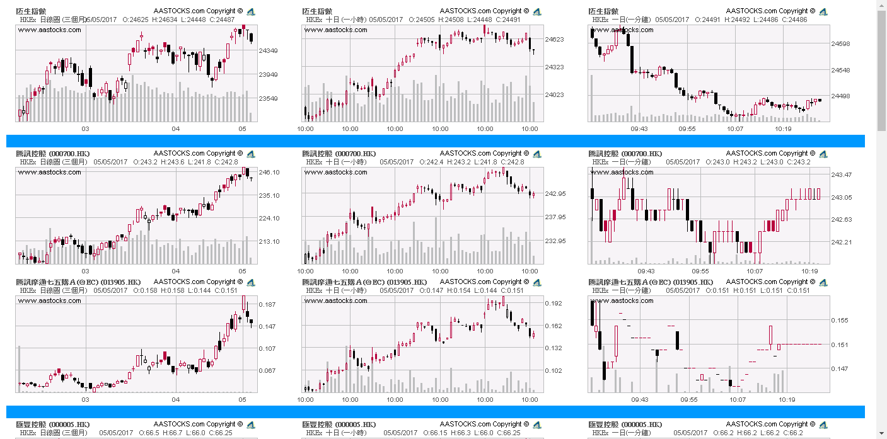

# Hong Kong Stock Charts
If you want to monitor your portfolios in office but don't want to open aastocks... these small html files suitable for you.

- No server needed
- Auto refresh charts
- Portable

Just download 3 files and open in local browser, that's it!

# Screen shot 

